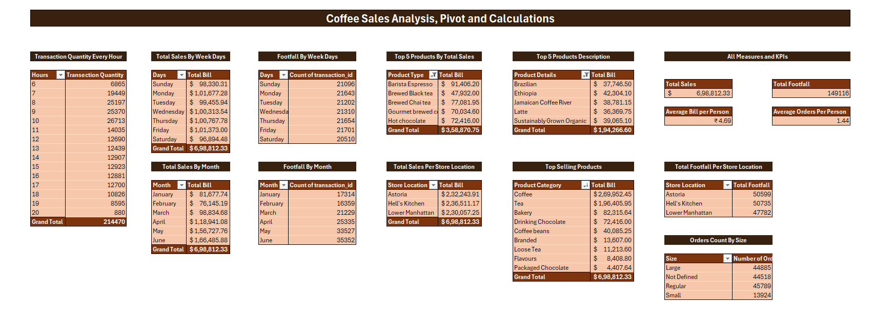
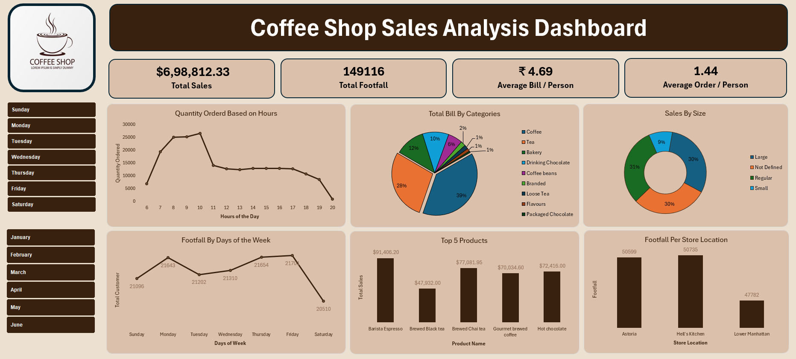

# Coffee Shop Sales Analysis Project

## Overview
This project involved creating an interactive sales dashboard for a coffee shop using Microsoft Excel's Power Query and Pivot Tables. The objective was to analyze transactional data, identify trends, and provide actionable insights for decision-making.

---

## Tools and Technologies Used
- **Microsoft Excel**: Data cleaning, transformation, and dashboard creation.
- **Power Query**: For data extraction, transformation, and loading (ETL) processes.
- **Pivot Tables**: For aggregating and summarizing data for visualizations.

---

## Data Cleaning and Transformation
1. **Data Loading**:
   - Imported transaction data into Power Query for preprocessing.

2. **Transformations**:
   - Extracted a new column `Size` from `product_details` to categorize sizes (e.g., `Sm` as `Small`, `Lg` as `Large`, etc.).
   - Created a new column `Total_Bill` by multiplying `transition_qty` and `unit_price`.
   - Modified the `transection_time` column to remove the incorrect date, retaining only time values.
   - Extracted `Month`, `Weekdays`, and `Hours` for temporal analysis from `transection_date` and `transection_time`.
   - Extracted numeric representations of weekdays and months for sequence-based sorting.

---

## Coffee Sales Analysis, Pivot, and Calculations

This analysis provides insights into coffee sales data, including transaction patterns, total sales, footfall, top-selling products, and more. The findings are based on various pivot tables and calculations. Below is a summary of the analysis.



## Key Insights and Highlights

### 1. **Transaction Quantity by Hour**
   - **Peak Hours:** The highest transactions occur at 8 AM, 9 AM, and 10 AM.
   - **Least Activity:** Minimal transactions occur after 8 PM.

### 2. **Total Sales by Weekdays**
   - **Highest Sales:** Thursday and Friday generate the most sales, with over $1,00,000 each.
   - **Lowest Sales:** Sundays have the least sales at $98,330.31.

### 3. **Footfall by Weekdays**
   - **Highest Footfall:** Monday and Friday observe the highest customer count.
   - **Lowest Footfall:** Saturday sees the least number of transactions.

### 4. **Top 5 Products by Total Sales**
   - **Top Product:** Barista Espresso leads with $91,406.20.
   - **Other Products:** Brewed Black Tea, Brewed Chai Tea, Gourmet Brewed Coffee, and Hot Chocolate follow.

### 5. **Top 5 Product Descriptions**
   - Products like **Brazilian**, **Ethiopia**, and **Jamaican Coffee River** generate significant revenue, each around $38,000-$40,000.

### 6. **Total Sales by Month**
   - **Highest Revenue:** June sees the highest sales at $1,66,485.88.
   - **Lowest Revenue:** February has the lowest sales at $76,145.19.

### 7. **Footfall by Month**
   - **Highest Footfall:** May and June record the maximum customer transactions.
   - **Lowest Footfall:** January and February observe the least footfall.

### 8. **Total Sales Per Store Location**
   - **Top Location:** Astoria contributes the most to sales with $2,32,243.91.
   - Other locations like **Hell's Kitchen** and **Lower Manhattan** also have substantial revenue.

### 9. **Top-Selling Product Categories**
   - **Coffee** dominates with $2,69,952.45, followed by **Tea** ($1,96,405.95) and **Bakery** ($82,315.64).

### 10. **Total Footfall Per Store Location**
   - **Astoria** and **Hell's Kitchen** have almost equal footfalls, followed by **Lower Manhattan**.

### 11. **Orders Count by Size**
   - **Most Ordered Size:** Large orders lead with 44,885 transactions.
   - **Least Ordered Size:** Small orders account for only 13,924 transactions.

### 12. **Key Metrics**
   - **Total Sales:** $6,98,812.33
   - **Total Footfall:** 1,49,116
   - **Average Bill per Person:** ₹4.69
   - **Average Orders per Person:** 1.44

###This analysis helps identify peak sales periods, customer preferences, and the most profitable locations and products. It can be used for strategic planning, inventory management, and marketing efforts.

---

## Dashboard Features



### Key Metrics:
- **Total Sales**: $6,98,812.33
- **Total Footfall**: 149116
- **Average Bill/Person**: ₹4.69
- **Average Orders/Person**: 1.44

### Visualizations:
1. **Hourly Sales Trend**:
   - Line chart showing sales patterns by hour to identify peak and off-peak times.
2. **Category-wise Sales Distribution**:
   - Pie chart showing sales contribution by product categories (e.g., Coffee: 39%, Bakery: 29%).
3. **Sales by Size**:
   - Donut chart illustrating sales distribution by cup sizes (e.g., Small, Regular, Large).
4. **Footfall Analysis**:
   - Line chart showing footfall trends by weekdays.
5. **Top-Selling Products**:
   - Bar chart highlighting the top 5 products based on total revenue.
6. **Store Location Analysis**:
   - Bar chart showing footfall distribution across store locations (e.g., Astoria, Lower Manhattan).

---

## Findings
1. **Peak Hour Analysis**:
   - Sales peaked between 9 AM and 12 PM, indicating high morning demand.
2. **Product Categories**:
   - Coffee accounted for the largest share of sales (39%), followed by Bakery items (29%).
3. **Top Products**:
   - The best-selling product was Barista Espresso ($1,730.80), followed by Brewed Chai Tea.
4. **Location Insights**:
   - Astoria had the highest footfall (963 customers).

---

## Future Scope
- **Automation**:
  - Implement macros or VBA for real-time updates.
- **Scalability**:
  - Integrate with Power BI or Tableau for enhanced interactivity.
- **Data Sources**:
  - Connect directly to databases for live data feeds.
- **Additional Metrics**:
  - Include customer demographics and loyalty program analysis.

---

## How to Access the Dashboard
1. Download the Excel file from this repository.
2. Open the file in Microsoft Excel (2016 or later).
3. Navigate to the "Dashboard" tab to view the visualizations.

---

## Repository Structure
```
|-- Coffee_Shop_Sales_Analysis
    |-- Data
        |-- Coffee Shop Sales.xlsx
    |-- Dashboard
        |-- Coffee Sales Data Analysis and Dashboard.xlsx
    |-- Documentation
        |-- README.md
```

---

Feel free to reach out for collaboration or suggestions on this project!

